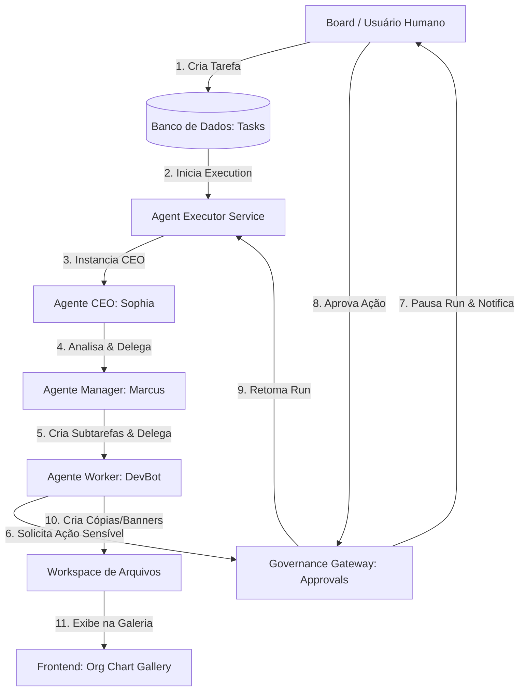
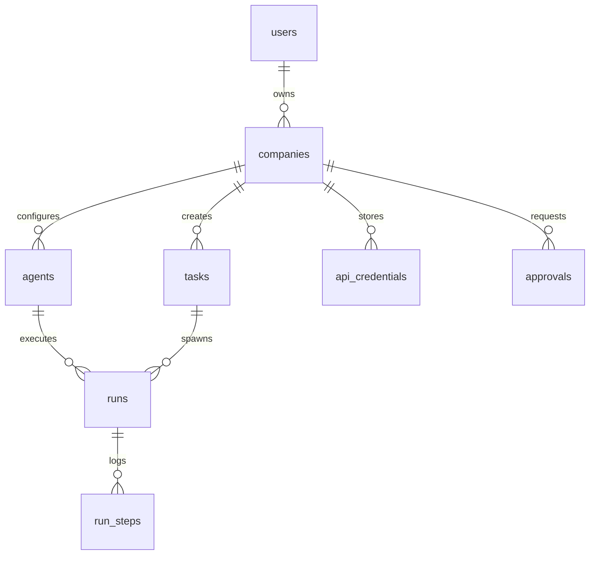

# Guia do Sistema - AI Agent Orchestrator Control Plane

Esta documentação fornece uma explicação abrangente e detalhada sobre o funcionamento do **AI Agent Orchestrator Control Plane**, abrangendo a sua arquitetura de microsserviços, modelagem de dados, motor de execução de agentes, governança humana, gerenciamento de artefatos e integrações como Meta Ads e WebSockets.

---

## 1. Visão Geral do Sistema

O **AI Agent Orchestrator Control Plane** é uma plataforma multi-agente autônoma projetada para simular uma estrutura corporativa hierárquica. Em vez de agentes operando de forma isolada, eles colaboram sob uma árvore organizacional (ex: CEO $\rightarrow$ Gerente de Engenharia $\rightarrow$ Desenvolvedor) para atingir os objetivos da empresa. 

O sistema possui regras rígidas de:
- **Isolamento de Tenant (Multi-empresa)**: Os dados e workspaces de arquivos de uma empresa não podem ser acessados por usuários ou agentes de outras empresas.
- **Governança (Human-in-the-Loop)**: Ações de alto custo ou comandos do sistema operacional (como comandos bash) exigem aprovação humana antes da execução.
- **Controle de Custos**: Limites de orçamento rígidos no nível da empresa e do agente evitam loops infinitos de LLM com alto consumo financeiro.

---

## 2. Arquitetura do Sistema

O sistema é dividido em duas partes principais:
1. **Frontend (React + Vite + TailwindCSS / Vanilla CSS)**: Painel interativo para monitoramento das tarefas, gráfico organizacional (Org Chart), central de aprovações, configuração de credenciais e galeria de artefatos gerados pelos agentes.
2. **Backend (FastAPI + SQLAlchemy + Alembic)**: API REST assíncrona com suporte a WebSockets para transmissão de logs e estados das tarefas em tempo real. Os agentes usam modelos Claude (Anthropic) com suporte nativo a Tool Calling.

### Fluxograma de Execução e Delegação

O diagrama abaixo ilustra o fluxo de vida de uma tarefa e a interação dos agentes:

---

## 3. Modelagem de Banco de Dados

O banco de dados utiliza SQLite (via `aiosqlite` para operações assíncronas) com a seguinte estrutura de tabelas:

### Detalhes das Tabelas

1. **`users`**:
   - Guarda o login do administrador da empresa.
   - Atributos: `id`, `email`, `password_hash`, `created_at`.
   
2. **`companies`**:
   - Define os limites globais do tenant.
   - Atributos:
     - `mission`: Declaração de missão natural que guia as decisões contextuais dos agentes.
     - `monthly_budget_usd`: Orçamento financeiro limite mensal para chamadas de LLM.
     - `markup_pct`: Margem adicionada sobre o custo real do token da API para fins de faturamento/relatório do cliente (ex: markup de 25% transforma $1.00 de custo em $1.25).

3. **`agents`**:
   - Configura a inteligência, ferramentas e posição hierárquica do agente.
   - Atributos:
     - `boss_agent_id`: FK autorreferencial que constrói a árvore organizacional (`Sophia` $\rightarrow$ `Marcus` $\rightarrow$ `DevBot`).
     - `adapter_type` & `model`: Configuração do provedor e modelo de IA (ex: `claude-3-5-sonnet-20241022`).
     - `tools`: Lista JSON de ferramentas permitidas para este agente específico.
     - `monthly_budget_usd`: Limite financeiro que o agente individual pode consumir.
     - `status`: `active`, `paused` ou `exhausted` (quando atinge o limite do orçamento).

4. **`tasks`**:
   - O backlog de atividades da empresa. Podem ser tarefas primárias criadas pelo usuário ou sub-tarefas geradas por delegações entre agentes.
   - Atributos: `title`, `description`, `status` (`todo`, `in_progress`, `done`, `failed`, `paused`), `assignee_agent_id`, `parent_task_id`.

5. **`runs`** & **`run_steps`**:
   - Rastreabilidade detalhada de auditoria. Cada execução (`Run`) de um agente para resolver uma tarefa é dividida em passos (`RunStep`).
   - Atributos de `run_steps`:
     - `kind`: Tipo do passo (`llm_call`, `tool_call`, `delegation`, `approval`).
     - `input` / `output`: Parâmetros passados e retornos obtidos.
     - `tokens`, `cost_usd`, `latency_ms`: Métricas de uso e performance para a contabilidade de tokens.

6. **`approvals`**:
   - Gerencia a governança humana. Ações de risco (ex: comando bash) criam uma solicitação aqui.
   - Atributos: `action_type`, `payload` (detalhes do comando/ação), `status` (`pending`, `approved`, `rejected`), `decided_by`, `decided_at`.

7. **`api_credentials`**:
   - Armazena segredos de terceiros de forma criptografada (ex: tokens Meta Ads, chaves extras).
   - Atributos: `provider`, `encrypted_key`, `last4` (para visualização segura no painel).

---

## 4. O Loop de Execução dos Agentes (`AgentExecutor`)

O coração do backend é o [agent_executor.py](file:///C:/Users/caiov/Documents/antigravity/busy-hopper/backend/app/services/agent_executor.py). Ele coordena o ciclo de vida do pensamento do agente.

### Funcionamento do Ciclo de Pensamento:
1. **Recuperação de Contexto**: O executor monta o histórico da run, incluindo a descrição da tarefa, a missão da empresa, as instruções de papel do agente (system prompt) e a hierarquia organizacional dele.
2. **Chamada ao LLM**: Envia o histórico com as definições das ferramentas disponíveis (`tools`) ao modelo.
3. **Análise de Tool Calls**:
   - Se o LLM decidir encerrar a tarefa com uma mensagem final, a execução é dada como concluída.
   - Se o LLM decidir chamar uma ferramenta, o executor intercepta e valida se a ferramenta está na lista de `tools` do agente (Garantia de Menor Privilégio).
   - **Intercepção de Ações Sensíveis**: Se a ferramenta for sensível (como executar comandos bash), o executor suspende o loop, muda o status da `Run` para `paused`, salva um registro de `Approval` e dispara um sinal de WebSocket.
   - Se a ferramenta for segura (como busca na web ou leitura/escrita de arquivos dentro da pasta permitida), ela é executada imediatamente e o retorno é alimentado de volta ao LLM.

### Gestão Financeira e Controlo de Custos:
- **Markup**: Quando o LLM retorna o consumo de tokens (input/output), o backend calcula o custo bruto da API. O custo cobrado do agente e registrado no banco é multiplicado pela taxa da empresa:
  $$\text{Custo Cobrado} = \text{Custo Real} \times \left(1 + \frac{\text{markup\_pct}}{100}\right)$$
- **Budget Lock**: Antes de cada chamada de LLM, o executor valida se o custo acumulado do agente ou da empresa não ultrapassou os limites configurados. Se ultrapassar, a tarefa é pausada imediatamente e marcada como travada por orçamento (`exhausted`).

---

## 5. Gateways de Governança (Human-in-the-Loop)

Para garantir segurança operacional completa, certas ferramentas e ações exigem aprovação humana explícita antes que o agente continue:

### 1. Comandos de Terminal (`run_bash_command`):
- O agente não tem permissão para rodar comandos Bash de forma arbitrária.
- Quando o LLM emite a chamada da ferramenta bash, o executor cria um ticket de aprovação com o comando exato (ex: `npm run build` ou `python script.py`).
- O usuário visualiza o comando e os riscos associados na aba **Approvals** do frontend, podendo aprovar ou rejeitar.
- Ao aprovar, o backend executa o comando de forma segura em subprocesso, coleta a saída padrão (stdout/stderr) e envia como resposta da ferramenta para o agente, que retoma o loop.

### 2. Disparos e Publicações de Campanhas (`execute_meta_campaign`):
- Agentes de marketing podem sugerir campanhas publicitárias. No entanto, o envio das requisições para a API do Meta exige aprovação prévia para evitar cobranças indevidas de anúncios.

---

## 6. Galeria de Workspace e Asset Creator (SVG)

Um diferencial do painel é a capacidade de auditar os arquivos de trabalho criados pelos agentes na sua pasta exclusiva de workspace (`workspace/company_{company_id}/`).

### 1. Geração de Arte Criativa (`generate_image_asset`):
- Para apoiar as campanhas criadas pelos agentes, o sistema inclui a ferramenta `generate_image_asset`.
- Quando o agente solicita a criação de uma imagem, o backend renderiza de forma programática um arquivo vetorial **SVG** altamente estilizado contendo gradientes modernos, tipografia limpa, formas geométricas e a mensagem publicitária contextual baseada no prompt do agente.
- O SVG é gravado no diretório de workspace da empresa com uma nomenclatura organizada (ex: `creative_banner_123.svg`).

### 2. Visualizador e Auditor de Workspace:
- No **Org Chart**, ao clicar em **Inspect Work** no card de qualquer agente, um modal dinâmico é carregado.
- Esse modal lista todos os arquivos gerados pelo agente correspondente durante a execução de suas runs.
- **Leitura de Texto**: Arquivos `.txt`, `.json` ou `.html` são lidos e exibidos em um painel de visualização de código.
- **Visualização de Arte**: Arquivos SVG são carregados de forma segura como imagens protegidas.
- **Segurança na Entrega de Arquivos**: O frontend não pode expor caminhos físicos do servidor. Por isso, a API `/api/agents/{agent_id}/artifacts/{filename}` autentica a requisição com o token JWT do usuário ativo, valida o tenant e entrega o arquivo como um **Blob binário**, que é instanciado em tempo de execução no navegador (`URL.createObjectURL(blob)`).

---

## 7. Integração com Meta Ads

O sistema dispõe de uma funcionalidade dedicada à automação de campanhas de tráfego pago via Facebook/Meta Ads API.

### 1. Criptografia Segura (AES-256 via Fernet):
- O banco de dados nunca armazena chaves e Access Tokens de anúncios em texto plano.
- Usando a biblioteca `cryptography.fernet`, o backend utiliza uma chave de criptografia de 32 bytes (`ENCRYPTION_KEY`) definida nas variáveis de ambiente.
- As credenciais enviadas pelo frontend são criptografadas antes de serem inseridas na tabela `api_credentials`.
- Nas leituras de API, as chaves são descriptografadas em memória apenas para realizar a integração, e o endpoint público apenas expõe os últimos 4 caracteres da chave (`last4`) mascarando o restante por segurança.

### 2. Painel de Anúncios (Meta Ads):
- Permite configurar o Token de Acesso, ID da Conta de Anúncios, ID da Página e Pixel.
- Permite simular a criação de campanhas (onde o sistema gera públicos-alvo fictícios, orçamentos sugeridos e monta os criativos vetoriais SVG gerados pelos agentes).
- Mantém um histórico detalhado de todas as campanhas disparadas pela plataforma.

---

## 8. Comunicação em Tempo Real via WebSockets

A experiência interativa e viva do painel é assegurada por conexões bidirecionais de WebSockets, gerenciadas pelo [websocket_manager.py](file:///C:/Users/caiov/Documents/antigravity/busy-hopper/backend/app/services/websocket_manager.py).

### Mecanismos de Funcionamento e Segurança:
1. **Autenticação Injetada em Query**: Como os navegadores não suportam o envio de cabeçalhos customizados na abertura de WebSockets padrão, o token JWT do usuário é passado diretamente na URL como parâmetro de consulta:
   `ws://localhost:8000/api/tasks/ws?token=SUA_CHAVE_JWT`
2. **Verificação de Tenant**: O backend decodifica o token no momento da conexão, descobre qual `company_id` pertence àquele usuário, e adiciona a conexão WebSocket a um canal exclusivo daquela empresa. Isso garante que nenhum usuário veja logs de tarefas de outras corporações.
3. **Eventos Transmitidos**:
   - `task_updated`: Alteração de status da tarefa (ex: de `todo` para `in_progress`).
   - `run_step_added`: Publicação imediata de cada passo que o agente está realizando (ex: "Sophia pensando", "Marcus delegando tarefa"). Isso gera o feed em tempo real no visualizador de tarefas.
   - `run_paused`: Notificação instantânea de que um agente travou esperando por aprovação.

---

## 9. Estrutura de Telas e Navegação (Frontend)

O painel de controle é organizado nas seguintes visões:

* **Dashboard**: Visão executiva contendo gráficos financeiros acumulados (custos reais vs cobrados com markup), taxa de sucesso de tarefas, cards rápidos de pendências e visão panorâmica da missão atual da empresa.
* **Org Chart (Estrutura Organizacional)**: Gráfico em árvore da hierarquia dos agentes. Permite editar os prompts de sistema de cada agente, configurar as ferramentas disponíveis, visualizar os saldos orçamentários de cada um e abrir o **Workspace Inspector** para inspecionar criativos e copies gerados.
* **Tasks (Tarefas)**: Listagem de tarefas em Kanban ou tabelas. Ao clicar em uma tarefa em andamento, abre-se uma gaveta lateral que se conecta via WebSocket e exibe o progresso passo a passo do agente ativo (com gráficos de consumo de tokens em tempo real).
* **Approvals (Aprovações)**: Fila de auditoria onde o usuário revisa comandos sensíveis e disparos de marketing solicitados pelos agentes.
* **Meta Ads**: Central de configurações de anúncios, permitindo inserir credenciais e acompanhar o status de entrega das campanhas.
* **Settings**: Edição dos dados da empresa, declaração da missão e ajuste fino das chaves de API globais.
